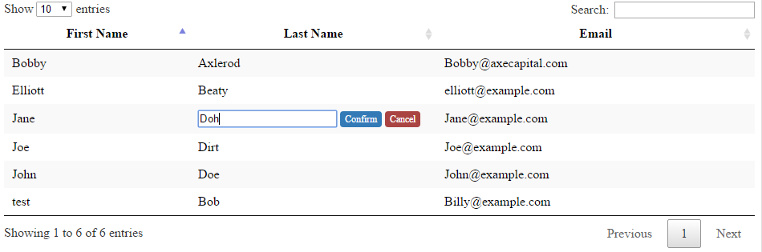

# CellEdit
##### A plugin for [DataTables.net](https://datatables.net) 
## Overview
This plugin allows cells within a [DataTable](https://datatables.net/) to be editable. When a cell is click on, an input field will appear. When focus is lost on the input and the underlying DataTable object will be updated and the table will be redrawn. The new value is passed to a callback function, along with it's row, allowing for easy server-side data updates. 



## Usage
### MakeCellsEditable(settings);
##### Settings { JSON Object  }
Property | Type | Default | Example | Details  
:------ | :------ | :------ | :-----| :------
**onUpdate** | function |  | ```function(cell, row, oldValue){ } ``` | The call back function to be executed. The updated **[cell](https://datatables.net/reference/api/cell())**, **[row](https://datatables.net/reference/api/row())**, and previous value in that cell are passed as arguements. 
**inputCss** _(optional)_| string | none |```'my-css-class'```| A CSS class that will be applied to the input field
**columns** _(optional)_| array | All columns |```[0,1,3,4]```| An array of column indexes defining the columns that you want to be editable.
**allowNulls** _(optional)_| object | false | ```{ "columns": [4], "errorClass":"my-error"}``` | Determines which columns should allow null values to be entered and what CSS to apply if user input fails validation. If **errorClass** is null a default error class will be applied.
**confirmationButton** _(optional)_| bool &#124; object | false | ```{"confirmClass":"button"}``` | Will cause two links to appear after the input; _"Confirm"_ and _"Cancel"_. User input will not be accepted until _"Confirm"_ is clicked by the user. You can optionally pass in an object with **confirmCss** and **cancelCss** properties instead of boolean. These propertiesspecify the CSS classes that should be applied to the _Confirm_ and _Cancel_ anchor tags.

### Basic Initialization
```javascript
    var table = $('#myTable').DataTable();

    function myCallbackFunction (updatedCell, updatedRow, oldValue) {
        console.log("The new value for the cell is: " + updatedCell.data());
        console.log("The values for each cell in that row are: " + updatedRow.data());
    }

    table.MakeCellsEditable({
        "onUpdate": myCallbackFunction
    });
```
### Advancted Initialization
```javascript
    var table = $('#myAdvancedTable').DataTable();

    function  myCallbackFunction(updatedCell, updatedRow, oldValue) {
        console.log("The new value for the cell is: " + updatedCell.data());
        console.log("The values for each cell in that row are: " + updatedRow.data());
    }

    table.MakeCellsEditable({
        "onUpdate": myCallbackFunction,
        "inputCss":'my-input-class',
        "columns": [0,1,2],
        "allowNulls": {
            "columns": [1],
            "errorClass": 'error'
        },
        "confirmationButton": { 
            "confirmCss": 'my-confirm-class',
            "cancelCss": 'my-cancel-class'
        }
    });
```
